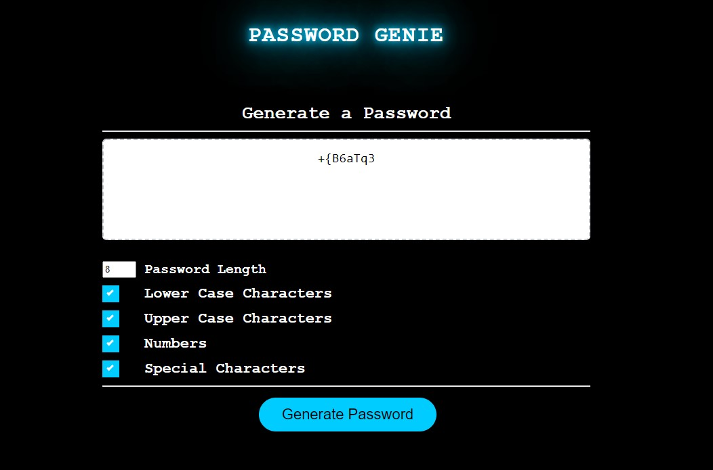

# Password-Genie

This is an application which will generate a random Password with the option to use 4 different variables (Lowercase, Uppercase, Numbers & Special characters).

## Inspiration

- I had the inspiration to build this Password Generator (Genie) application to develop my Javascript skills. Inspiration also came from the need to have a easier accessible tool with which to generate passwords since I will be interacting with a lot more different software and applications that require accounts and logins, requiring secure passwords (which aren't just the same 2 or 3 memorised password I had been using.)

## Updates

#### From the initial code that was provided as a base I made the following updates:

-   Created 4 different arrays covering all the available characters that can be used in generating a password (Lowercase, Uppercase, Numbers and Special characters). 
    - This was later amended to change those arrays to strings holding the values.
-   Added html code update to include the checkboxes and the textarea with up and down arrows make it easier for the user to quickly change the settings on the password and also quickly see which setting was selected.
-   Created 4 different functions to pull random values from their corresponding array. This was later discarded to utilise a simpler system by adding each different string of variables to a larger string dependent on user choice.
-   Added variables which captured the different password variable settings available for selection by the user and whether they were "checked"(selected).
-   Added loop to generate password from the selected variables in the concatenated string. 
-   Created a couple of conditional statements to restrict the password length and create parameters for the application so that the user has to have one setting selected.
-   Added css styling to represent a blue genie
-   Commented sections of my code in html, css and js files to breakup and distinguish easier the segments of code.
-   update of file names and links to allow github to display the website while changing repository anem to lowercase and also removing the #'s on the start of the html files.

## Skills and Knowledge learned

I learned a lot from all aspects on this project also, particularly on the design and methodology.
- Initially I learnt from the design side of the application and how important it was to design the application and have the different components broken down to implement each section simply.
- I learnt from the process of deciding whether to use prompts for the user to select the setting or to use the checkboxes and decided upon the checkboxes for multiple reasons; easier for the user to see and decide which setting they want or selected previously and also I found it easier to retrieve those values compared with thsoe stored in the prompts.
- Greatly improved my knowledge around functions in Javascript.
- solidfied my knowledge on accessing elements from the HTML doc and also adding content back into that element.
- solidified mu knowledge around conditional statements. I have some familiarity with them from working with formulas in excel, so wanted to understand how they worked in JS.
- Learnt a lot about loops and how they functioned and their power to perform repitive tasks.
- Still learning the "grammar" and functioning of JS and how different things interact. Once I get that sorted should help with the design and planning side to understand the best way to implement the app or what is possible and what won't or be too complicated.

## Application Example Images & Videos

### Password Genie USer Interface
x

### Showcase

## Credits
- https://www.w3schools.com/howto/howto_css_custom_checkbox.asp
- https://owasp.org/www-community/password-special-characters
- https://stackoverflow.com/questions/3610540/how-to-define-a-default-value-for-input-type-text-without-using-attribute-val
- https://stackoverflow.com/questions/6007219/how-to-add-default-value-for-html-textarea
https://www.programiz.com/javascript/examples/generate-random-strings#:~:text=random()%20method%20is%20used,a%20random%20character%20is%20generated.
- https://stackoverflow.com/questions/11800257/call-javascript-function-only-when-checkbox-is-not-checked/11800285#11800285
- Big Thank you to Nathan Loudon & Matthew Yang for all your help in bringing this project together